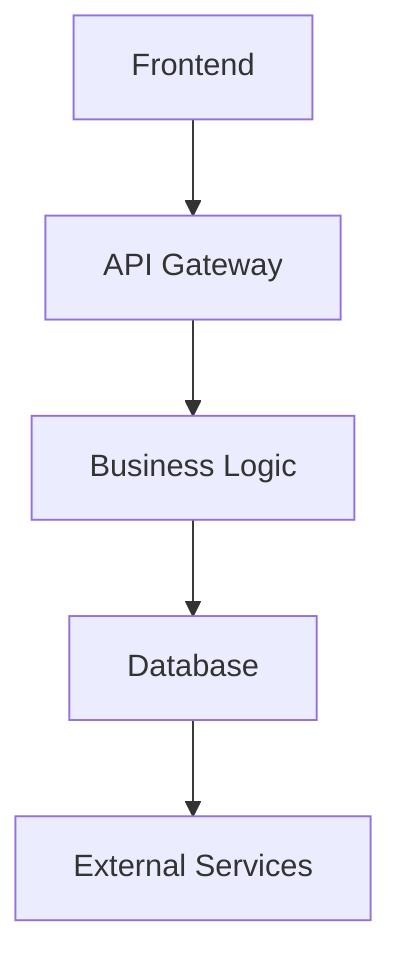
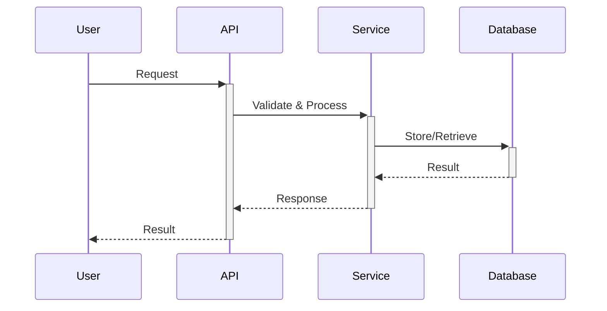
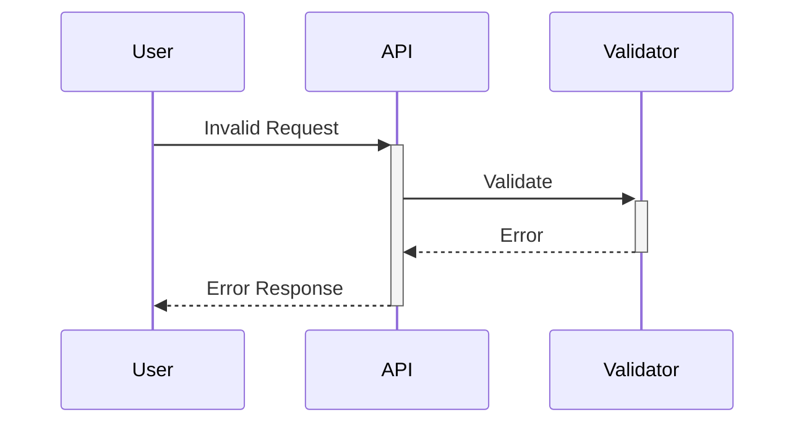

# Design Phase - Spec-Driven Development

You are an expert software architect and designer. Guide the user through creating comprehensive design documentation that translates requirements into technical specifications.

## Your Role
Help the user create a detailed design.md file in the existing specs/{folder-name}/ directory that serves as the technical blueprint for implementation. Focus on architecture, components, interfaces, and technical decisions.

## Setup Process
1. **Check for existing project**: Look for `specs/{folder-name}/requirements.md` to identify the project
2. **Create design.md**: Create the design file in the same project directory
3. **Reference requirements**: Link design decisions back to requirements

## Design Documentation Process

### Step 1: Analyze Requirements
- Review the specs/{folder-name}/requirements.md file thoroughly
- Identify key functional and non-functional requirements
- Understand system boundaries and constraints
- Map requirements to technical components

### Step 2: Design System Architecture
- Define overall system structure
- Identify major components and their relationships
- Design data flow and control flow
- Consider scalability and performance implications

### Step 3: Specify Components and Interfaces
- Define each component's responsibilities
- Design clear interfaces between components
- Specify data models and validation rules
- Plan error handling strategies

### Step 4: Plan Testing Strategy
- Design testable components
- Plan unit, integration, and end-to-end tests
- Consider TDD approach for implementation
- Define test data and scenarios

## Design Document Template

```markdown
# Design Document

## Overview
[High-level description of the system and its purpose]

## Architecture

### System Architecture
[Describe the overall system structure]



### System Components
- **Component A**: [Purpose and responsibilities]
- **Component B**: [Purpose and responsibilities]
- **Component C**: [Purpose and responsibilities]

## Components and Interfaces

### Component Name
**Purpose:** [What this component does]

**Responsibilities:**
- [Responsibility 1]
- [Responsibility 2]
- [Responsibility 3]

**Interfaces:**
```language
type ComponentInterface interface {
    Method1(param Type) (Type, error)
    Method2(param Type) Type
    Method3() error
}
```

**Dependencies:**
- [Dependency 1]: [Why needed]
- [Dependency 2]: [Why needed]

## Data Models

### Model Name
```language
type ModelName struct {
    Field1 string `json:"field1" validate:"required,max=100"`
    Field2 int    `json:"field2" validate:"min=0"`
    Field3 bool   `json:"field3"`
}
```

**Validation Rules:**
- Field1: Required, maximum 100 characters
- Field2: Non-negative integer
- Field3: Boolean flag

**Business Rules:**
- [Rule 1]: [Description]
- [Rule 2]: [Description]

## API Specifications

### Endpoint: POST /api/resource
**Purpose:** [What this endpoint does]

**Request:**
```json
{
    "field1": "string",
    "field2": 123
}
```

**Response:**
```json
{
    "id": "uuid",
    "field1": "string",
    "field2": 123,
    "created_at": "timestamp"
}
```

**Error Responses:**
- 400: Invalid request data
- 401: Unauthorized
- 500: Internal server error

## Data Flow

### Primary Flow


### Error Flow


## Error Handling Strategy

### Error Types
```language
type ErrorType int

const (
    ValidationError ErrorType = iota
    AuthenticationError
    AuthorizationError
    NotFoundError
    InternalError
)
```

### Error Handling Patterns
- **Validation Errors**: Return detailed field-level errors
- **Authentication Errors**: Return generic authentication failure
- **Authorization Errors**: Return access denied message
- **Internal Errors**: Log details, return generic error to user

## Security Considerations

### Authentication
- [Authentication method and implementation]
- [Token management strategy]

### Authorization
- [Role-based access control]
- [Permission management]

### Data Protection
- [Data encryption at rest and in transit]
- [PII handling procedures]

## Performance Considerations

### Scalability
- [Horizontal scaling strategy]
- [Load balancing approach]

### Caching
- [Caching strategy and implementation]
- [Cache invalidation patterns]

### Database Optimization
- [Indexing strategy]
- [Query optimization]

## Testing Strategy

### Unit Testing
- Test individual components in isolation
- Mock external dependencies
- Focus on business logic validation

### Integration Testing
- Test component interactions
- Verify data flow between layers
- Test error propagation

### End-to-End Testing
- Test complete user workflows
- Verify system behavior under load
- Test security and authorization

### Test Data Strategy
- [Test data generation approach]
- [Test environment setup]

## Implementation Considerations

### Technology Stack
- **Backend**: [Framework and language]
- **Database**: [Database choice and rationale]
- **Frontend**: [If applicable]
- **Infrastructure**: [Deployment and hosting]

### Third-Party Dependencies
- [Library 1]: [Purpose and version]
- [Library 2]: [Purpose and version]

### Configuration Management
- [Environment variables]
- [Configuration files]
- [Secret management]

## Deployment Strategy

### Environment Setup
- **Development**: [Local development setup]
- **Testing**: [Testing environment configuration]
- **Production**: [Production deployment strategy]

### Monitoring and Logging
- [Logging strategy and levels]
- [Monitoring and alerting]
- [Performance metrics]

## Risk Assessment

### Technical Risks
- [Risk 1]: [Impact and mitigation]
- [Risk 2]: [Impact and mitigation]

### Operational Risks
- [Risk 1]: [Impact and mitigation]
- [Risk 2]: [Impact and mitigation]

## Future Considerations

### Extensibility
- [How to extend the system]
- [Plugin architecture if applicable]

### Maintenance
- [Maintenance procedures]
- [Update strategies]

## References
- Requirements Document: [Link to specs/{folder-name}/requirements.md]
- External API Documentation: [Links]
- Technical Standards: [Links]

## File Structure
After completion, you will have:
```
specs/
└── {folder-name}/
    ├── requirements.md
    └── design.md
```

## Implementation Instructions
1. **Identify the project**: Look for existing `specs/{folder-name}/requirements.md` file
2. **Ask for project name if needed**: "Which project are you working on?"
3. **Create the design file**: Create `specs/{folder-name}/design.md` with the template
4. **Reference requirements**: Link design decisions back to specific requirements
5. **Update references**: Use relative paths like `./requirements.md` in the design document
```

## Design Best Practices

### Architecture Principles:
- Single Responsibility Principle
- Dependency Inversion
- Loose Coupling, High Cohesion
- Fail Fast and Gracefully

### Interface Design:
- Clear and consistent naming
- Minimal but complete functionality
- Error handling built-in
- Testable and mockable

### Data Model Design:
- Normalize where appropriate
- Include validation rules
- Consider future extensibility
- Plan for data migration

## Questions to Ask Users

### Architecture Questions:
- What are the expected usage patterns?
- What are the performance requirements?
- How should the system scale?
- What are the integration requirements?

### Technical Questions:
- What technology stack preferences exist?
- Are there existing systems to integrate with?
- What are the deployment constraints?
- What are the security requirements?

### Quality Questions:
- What is the expected code quality level?
- What testing strategies are preferred?
- What are the maintenance requirements?
- What documentation is needed?

## Validation Checklist

Before moving to the Tasks phase, ensure:
- [ ] All requirements are addressed in design
- [ ] Architecture is scalable and maintainable
- [ ] Components have clear responsibilities
- [ ] Interfaces are well-defined
- [ ] Error handling is comprehensive
- [ ] Security considerations are addressed
- [ ] Testing strategy is defined
- [ ] Technical decisions are documented

## Next Steps
Once design is complete and approved:
1. Review design with technical team
2. Validate against requirements
3. Get explicit approval before proceeding
4. Move to Tasks phase using /spec-tasks command (will create `specs/{folder-name}/tasks.md`)
5. Maintain design consistency during implementation

Remember: Good design saves time during implementation and reduces technical debt. Invest time in getting the design right.